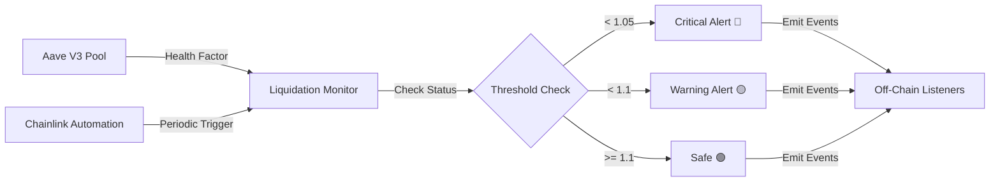

# 🚨 Aave V3 Liquidation Monitor

**Real-time monitoring system for Aave V3 lending positions to detect liquidation risks and prevent losses.**

[](https://getfoundry.sh/)
[](https://opensource.org/licenses/MIT)

## 📋 Table of Contents

- [Overview](#overview)
- [Features](#features)
- [Architecture](#architecture)
- [Getting Started](#getting-started)
- [Deployment](#deployment)
- [Chainlink Automation](#chainlink-automation)
- [Usage](#usage)
- [Testing](#testing)
- [Contract Addresses](#contract-addresses)

## 🎯 Overview

The Liquidation Monitor is a smart contract system that continuously tracks Aave V3 lending positions and alerts users when their health factors drop to dangerous levels. By monitoring positions in real-time, users can take preventive action before liquidation occurs.

### The Problem

DeFi users with leveraged positions on Aave V3 face constant liquidation risk during market volatility. Manual monitoring is:
- ⏰ Time-consuming and requires 24/7 attention
- 📉 Prone to missed alerts during rapid market movements
- 💸 Can result in costly liquidations (10-15% penalty on Aave)

### The Solution

Automated on-chain monitoring that:
- ✅ Tracks multiple positions simultaneously
- 🔔 Emits real-time alerts at configurable thresholds
- 🤖 Integrates with Chainlink Automation for continuous checking
- 📊 Provides historical health factor tracking

## ✨ Features

### Core Functionality
- **Multi-Wallet Monitoring**: Track unlimited Aave positions simultaneously
- **Smart Thresholds**: 
  - 🟡 Warning alerts at health factor < 1.1
  - 🔴 Critical alerts at health factor < 1.05
  - 🟢 Recovery notifications when positions become safe
- **Event-Driven Alerts**: All status changes emit events for off-chain monitoring
- **Owner Controls**: Add/remove wallets and adjust thresholds

### Automation Features
- **Chainlink Automation Integration**: Automated periodic health checks
- **Configurable Intervals**: Set custom check frequencies (default: 5 minutes)
- **Gas Efficient**: Optimized for batch checking multiple positions

### Safety Features
- **Historical Tracking**: Stores last health factor to detect trends
- **Status System**: 4-level status (Safe, Danger, Critical, Recovered)
- **Transparent**: All operations emit events for auditability

## 🏗️ Architecture

### Contract Structure

```
src/
├── LiquidationMonitor.sol              # Core monitoring contract
├── LiquidationMonitorAutomated.sol     # Chainlink Automation version
└── interfaces/
    ├── IAavePool.sol                   # Aave V3 Pool interface
    └── AutomationCompatibleInterface.sol
```

### System Flow



### Status Levels

| Status | Value | Health Factor | Description |
|--------|-------|---------------|-------------|
| 🟢 Safe | 1 | ≥ 1.1 | Position is healthy |
| 🟡 Danger | 2 | < 1.1 | Warning - approaching liquidation |
| 🔴 Critical | 3 | < 1.05 | Immediate risk of liquidation |
| 💚 Recovered | 0 | Was < 1.1, now ≥ 1.1 | Position recovered |

## 🚀 Getting Started

### Prerequisites

```bash
# Install Foundry
curl -L https://foundry.paradigm.xyz | bash
foundryup

# Clone the repository
git clone https://github.com/Skinny001/liquidation-monitor.git
cd liquidation-monitor
```

### Installation

```bash
# Install dependencies
forge install

# Build contracts
forge build

# Run tests
forge test
```

### Environment Setup

Create a `.env` file:

```bash
PRIVATE_KEY=0x...
RPC_URL=https://rpc.contract.dev/YOUR_API_KEY
```

## 📦 Deployment

### Deploy Standard Version

```bash
source .env
forge script script/Deploy.s.sol --rpc-url $RPC_URL --broadcast --legacy
```

### Deploy Automated Version (with Chainlink)

```bash
source .env
forge script script/DeployAutomated.s.sol --rpc-url $RPC_URL --broadcast --legacy
```

## 🤖 Chainlink Automation

The automated version (`LiquidationMonitorAutomated.sol`) implements Chainlink's `AutomationCompatibleInterface` for hands-free operation.

### Setting Up Automation

1. **Deploy the Automated Contract**
   ```bash
   forge script script/DeployAutomated.s.sol --rpc-url $RPC_URL --broadcast
   ```

2. **Register Upkeep on Stagenet**
   - Navigate to: DeFi → Chainlink → Automation
   - Click "Create New Upkeep"
   - Select "Custom Logic"
   - Enter your deployed contract address
   - The contract will automatically check positions every 5 minutes

### Automation Functions

```solidity
// Called by Chainlink to check if work is needed
function checkUpkeep(bytes calldata checkData) 
    external view returns (bool upkeepNeeded, bytes memory performData)

// Called by Chainlink to perform the work
function performUpkeep(bytes calldata performData) external

// Configure check frequency
function setCheckInterval(uint256 newInterval) external onlyOwner
```

## 💻 Usage

### Adding Wallets to Monitor

```bash
cast send <CONTRACT_ADDRESS> \
  "addWallet(address)" <WALLET_TO_MONITOR> \
  --rpc-url $RPC_URL \
  --private-key $PRIVATE_KEY
```

### Checking Health Manually

```bash
cast call <CONTRACT_ADDRESS> \
  "getHealthFactor(address)" <WALLET_ADDRESS> \
  --rpc-url $RPC_URL
```

### Running Batch Check

```bash
cast send <CONTRACT_ADDRESS> \
  "checkAllWallets()" \
  --rpc-url $RPC_URL \
  --private-key $PRIVATE_KEY
```

### Demo Script

Run the included demo to see the monitor in action:

```bash
./demo.sh
```

## 🧪 Testing

### Run All Tests

```bash
forge test
```

### Run with Verbosity

```bash
forge test -vvv
```

### Test Coverage

```bash
forge coverage
```

### Test Results

```
Running 11 tests for test/LiquidationMonitor.t.sol:LiquidationMonitorTest
[PASS] test_AddWallet() (gas: 81553)
[PASS] test_AddWalletEmitsEvent() (gas: 82856)
[PASS] test_CannotAddDuplicateWallet() (gas: 83358)
[PASS] test_CheckAllWallets() (gas: 205788)
[PASS] test_CriticalAlert() (gas: 129921)
[PASS] test_OnlyOwnerCanAddWallet() (gas: 14125)
[PASS] test_PositionRecovery() (gas: 142502)
[PASS] test_RemoveWallet() (gas: 65335)
[PASS] test_SafeHealthFactor() (gas: 121899)
[PASS] test_UpdateThreshold() (gas: 14340)
[PASS] test_WarningAlert() (gas: 132003)

Test result: ok. 11 passed; 0 failed
```

## 📍 Contract Addresses

### Contract.dev Workspace (Chain ID: 99561) - **ACTIVE**

| Contract | Address | Features |
|----------|---------|----------|
| **🟢 LiquidationMonitor (Current)** | `0x2cdED3F23eb62f809D9577e89e73d5d317BD5bB6` | **Active deployment - Use this!** |
| Owner Wallet | `0x6e8639EA2a7cFc527226973C5d040108B50F3A30` | Platform-provided funded wallet |

### Stagenet (Chain ID: 58092) - Previous Deployments

| Contract | Address | Features |
|----------|---------|----------|
| LiquidationMonitor (Latest) | `0xA3C39144C3c1164c7e99e7a0579534631A2ce297` | Manual monitoring |
| LiquidationMonitor (v1) | `0x9a129Ef786fff0F9Ce334A10D6ae1691399755cc` | Previous deployment |
| LiquidationMonitorAutomated | `0xcAa317607CC82889E346f931673d28007a554863` | Chainlink Automation (5 min intervals) |
| Aave V3 Pool | `0x87870Bca3F3fD6335C3F4ce8392D69350B4fA4E2` | Ethereum Mainnet Replay |

## 📊 Key Functions

### View Functions

```solidity
// Get health factor and status for a wallet
function getHealthFactor(address wallet) 
    external view returns (uint256 healthFactor, uint8 status)

// Get all monitored wallets
function getMonitoredWallets() 
    external view returns (address[] memory)

// Get number of monitored wallets
function getWalletCount() 
    external view returns (uint256)

// Check if wallet is monitored
function isMonitored(address wallet) 
    external view returns (bool)
```

### State-Changing Functions

```solidity
// Add wallet to monitoring (owner only)
function addWallet(address wallet) external onlyOwner

// Remove wallet from monitoring (owner only)
function removeWallet(address wallet) external onlyOwner

// Check health of a single wallet
function checkHealth(address wallet) 
    public returns (uint256 healthFactor, uint8 status)

// Check all monitored wallets
function checkAllWallets() external

// Update danger threshold (owner only)
function setDangerThreshold(uint256 newThreshold) external onlyOwner

// Update critical threshold (owner only)
function setCriticalThreshold(uint256 newThreshold) external onlyOwner
```

## 📡 Events

```solidity
event WalletAdded(address indexed wallet)
event WalletRemoved(address indexed wallet)
event HealthChecked(address indexed wallet, uint256 healthFactor, uint8 status)
event WarningAlert(address indexed wallet, uint256 healthFactor, uint256 blockNumber)
event CriticalAlert(address indexed wallet, uint256 healthFactor, uint256 blockNumber)
event PositionSafe(address indexed wallet, uint256 healthFactor)
event AutomationPerformed(uint256 timestamp, uint256 walletsChecked)
```

## 🛠️ Tech Stack

- **Smart Contracts**: Solidity 0.8.19
- **Development Framework**: Foundry
- **Testing**: Forge
- **Automation**: Chainlink Automation
- **Integration**: Aave V3 Protocol
- **Network**: Stagenet (Ethereum Mainnet Replay)

## 🔐 Security Considerations

- ✅ Owner-only controls for sensitive functions
- ✅ Input validation on all state-changing functions
- ✅ Comprehensive test coverage (11/11 passing)
- ✅ Events for all state changes
- ✅ No external calls in view functions
- ✅ Reentrancy-safe (no external calls in critical paths)

## 🎯 Use Cases

1. **Personal Risk Management**: Monitor your own Aave positions
2. **Portfolio Management**: Track multiple client positions
3. **Liquidation Bot**: Identify at-risk positions for liquidation
4. **Alert Service**: Build notification systems for DeFi users
5. **Analytics**: Gather health factor trends and statistics

## 📈 Future Enhancements

- [ ] Multi-protocol support (Compound, MakerDAO)
- [ ] Telegram/Discord bot integration
- [ ] Historical analytics dashboard
- [ ] Automated position management (auto-repay)
- [ ] Flash loan integration for self-liquidation
- [ ] Support for multiple Aave markets

## 📄 License

This project is licensed under the MIT License - see the [LICENSE](LICENSE) file for details.

## 🤝 Contributing

Contributions are welcome! Please feel free to submit a Pull Request.

## 📞 Contact

- GitHub: [@Skinny001](https://github.com/Skinny001)
- Repository: [liquidation-monitor](https://github.com/Skinny001/liquidation-monitor)

## 🙏 Acknowledgments

- [Aave](https://aave.com/) for the lending protocol
- [Chainlink](https://chain.link/) for automation infrastructure
- [Foundry](https://getfoundry.sh/) for the development framework
- [Contract.dev](https://contract.dev/) for Stagenet infrastructure

---

**Built for the Stagenet Hackathon 2026** 🚀
